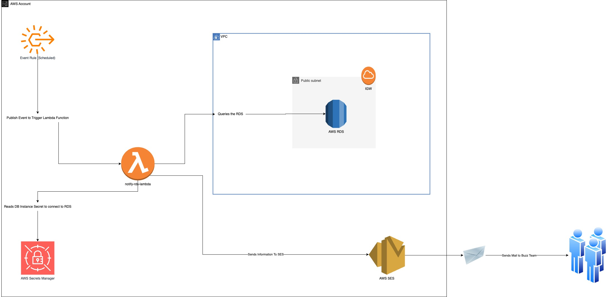

# Buzz Women Email Notification Infra Setup

A serverless AWS CDK application that monitors customer requests and automatically notifies the team via email with detailed reports.

## Architecture Overview



This CDK application deploys a **scheduled Lambda function** that:
- Connects to an existing RDS MySQL database
- Queries for customers who requested counselling contact
- Generates Excel reports per customer
- Sends email notifications with attachments via SES

## Prerequisites

- AWS CLI configured with appropriate permissions
- Node.js and AWS CDK installed
- Docker installed (for Lambda layer building)
- Existing RDS instance and VPC infrastructure

## Setup Instructions

### **1. Clone and Install Dependencies**

```bash
npm install
```

### **2. Create Secrets Configuration**

Create a `.secrets.json` file in the project root directory:

```json
{
  "BuzzWomen/BuzzChatAdmin": {
    "username": "your_database_username",
    "password": "your_database_password"
  }
}
```

> **Important**: Replace the placeholder values with your actual RDS database credentials. This file will be used to create AWS Secrets Manager secrets during deployment.

### **3. Configure Deployment Settings**

Update the configuration in `config.ts`:

- **Account ID**: Replace `"456474534321"` with your AWS account ID
- **VPC ID**: Update `vpcId` with your existing VPC ID
- **RDS Details**: Configure your RDS hostname, database name, and security group
- **Email Settings**: Set your SES verified email addresses

### **4. Deploy the Application**

```bash
# Bootstrap CDK (first time only)
cdk bootstrap

# Deploy all stacks
cdk deploy --all
```

## Cost Analysis
| Resource               | Quantity | Pricing Model                    | Estimated Monthly Cost (USD) | Notes                                                                                       |
|------------------------|----------|----------------------------------|------------------------------|---------------------------------------------------------------------------------------------|
| AWS Lambda             | 1        | 1 invocation/day, 512 MB, 3 min  | <$0.01                       | First 1M requests & 400,000 GB-seconds/month are free (within Free Tier)                    |
| Amazon EventBridge     | 1 rule   | Schedule-based                   | <$0.01                       | First 100,000 events/month free                                                             |
| AWS Secrets Manager    | 1 secret | $0.40/secret/month               | $0.40                        | Additional API calls may incur minor charges                                                |
| Amazon SES             | Emails   | $0.10/1,000 emails               | <$0.10                       | First 62,000 emails/month are free if sent from EC2 or Lambda in the same region            |
| Amazon RDS             | Existing | Not managed by CDK in this setup | --                           | Assumes RDS is already provisioned; not included in this stack’s cost                       |
| VPC                    | Existing | Not managed by CDK in this setup | --                           | Assumes VPC is already provisioned; not included in this stack’s cost                       |
| Amazon S3              | 0        | N/A                              | $0.00                        | Not used directly                                                                           |
| CloudWatch Logs        | 1 group  | $0.50/GB ingested                | <$0.05                       | Minimal usage for Lambda logs                                                               |[1]

### **Total Estimated Monthly Cost: ~$0.50 or less (excluding RDS and VPC, which are existing resources)**

> Note: The Lambda and EventBridge usage is within the AWS Free Tier for this application. Costs for RDS and VPC are not included, as they are assumed to be existing and not managed by this CDK stack.


## Stack Components

### **VPC Stack**
- References existing VPC infrastructure
- Provides network context for other resources

### **RDS Stack**
- Creates AWS Secrets Manager secret from `.secrets.json`
- References existing RDS database instance
- Manages database security group permissions

### **Scheduler Stack**
- **Lambda Function**: Python 3.12 runtime with Docker-based deployment
- **EventBridge Rule**: Scheduled execution (daily by default)
- **IAM Permissions**: SES email sending and RDS access
- **Environment Variables**: Database connection and email configuration

## Lambda Function Features

The notification Lambda function:
- **Database Query**: Fetches counselling completion data from the last 24 hours
- **Excel Generation**: Creates individual reports per customer using pandas
- **Email Delivery**: Sends multi-attachment emails via SES
- **Error Handling**: Includes retry logic and comprehensive logging

## Environment Variables

The Lambda function uses these environment variables:
- `RDS_HOST`: Database endpoint
- `RDS_SECRET_ARN`: Secrets Manager ARN for database credentials
- `RDS_DB`: Database name
- `FROM_EMAIL`: SES verified sender email
- `TO_EMAILS`: Comma-separated recipient list

## Security Considerations

- Database credentials stored securely in AWS Secrets Manager
- IAM roles follow least-privilege principle
- Lambda function has minimal required permissions
- `.secrets.json` should be added to `.gitignore`

## Customization

### **Schedule Modification**
Update `cronExpression` in `config.ts`:
```typescript
cronExpression: "rate(12 hours)" // Every 12 hours
cronExpression: "cron(0 9 * * ? *)" // Daily at 9 AM
```

### **Query Time Range**
Modify Lambda environment variables:
- `DIFF_DAYS`: Number of days to look back
- `DIFF_HOURS`: Additional hours
- `DIFF_MINS`: Additional minutes

## Monitoring and Troubleshooting

- **CloudWatch Logs**: Monitor Lambda execution logs
- **SES Metrics**: Track email delivery success rates
- **Lambda Metrics**: Monitor function duration and error rates

## Cleanup

```bash
cdk destroy --all
```
