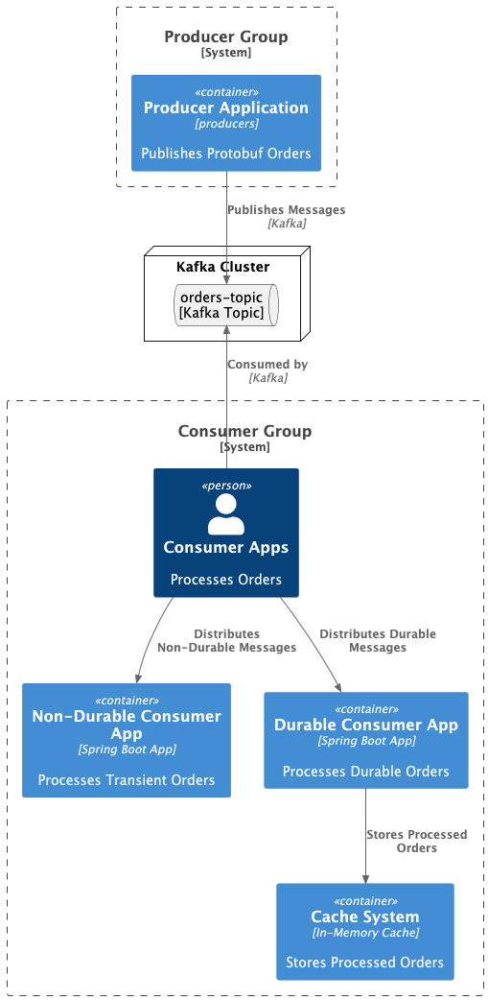
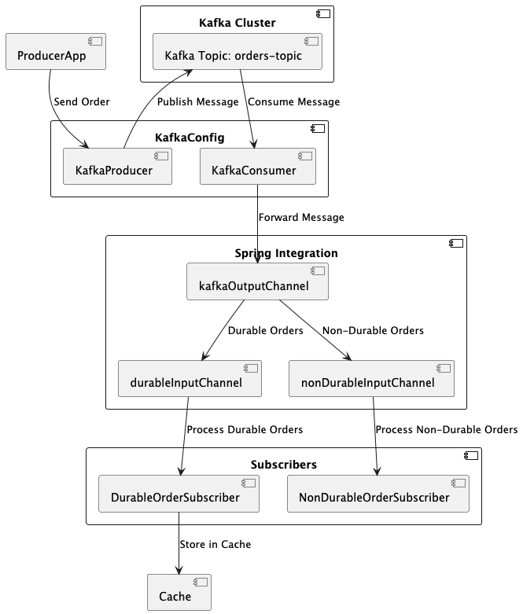

### **README for Kafka-based Order Processing System**

This implementation sets up a Kafka-based system for processing orders using Protobuf serialization. 

It includes Kafka producers and consumers, Spring Integration channels, and message handlers for durable and non-durable order processing.

---

### **Design Diagram**




---

### **Process Overview**
1. **Order Production**:
    - Orders are serialized using Protobuf and sent to a Kafka topic (`orders-topic`) via a `KafkaProducer`.
    - The producer uses Protobuf serialization for message values and String serialization for keys.

2. **Order Consumption**:
    - Two types of consumers are configured:
        - A **durable consumer** that ensures messages are stored in a cache to avoid duplication.
        - A **non-durable consumer** that processes transient messages without persistence.
    - Both consumers use Protobuf deserialization to interpret the messages.

3. **Spring Integration**:
    - Kafka messages are polled by an inbound adapter and sent to an output channel (`kafkaOutputChannel`).
    - The messages are routed to specific input channels (`durableInputChannel` or `nonDurableInputChannel`) based on the type of subscription.
    - Service activators process the messages using respective message handlers.

4. **Durability**:
    - Durable orders are cached locally using an `AbstractCache` implementation to prevent duplicate processing.

5. **Non-Durable Orders**:
    - Non-durable orders are processed immediately without caching, suitable for transient use cases.

---

### **Benefits of This Design**
1. **Scalability**: Kafka ensures high throughput for message production and consumption.
2. **Resilience**: Durable subscribers prevent data loss by caching processed messages.
3. **Flexibility**: Non-durable subscribers allow lightweight, transient message processing.
4. **Extensibility**: Modular design enables easy addition of new features or subscribers.
5. **Serialization Efficiency**: Protobuf ensures compact, efficient data transfer over Kafka.

This setup is ideal for systems requiring reliable, scalable, and efficient order processing with both durable and non-durable workflows.

## Kafka Setup

```bash
# Install Kafka (includes Zookeeper)
brew install kafka

# Start Zookeeper in one terminal
brew services start zookeeper

# Start Kafka in another terminal
brew services start kafka

# Create a Kafka topic
kafka-topics --create --topic orders-topic \
  --bootstrap-server localhost:9092 \
  --partitions 1 \
  --replication-factor 1
  
# Verify topic creation
kafka-topics --list --bootstrap-server localhost:9092

# Add to consumer group
kafka-console-consumer \
  --topic orders-topic \
  --bootstrap-server localhost:9092 \
  --group my-consumer-group \
  --from-beginning

# Producer CLI
kafka-console-producer --topic orders-topic --bootstrap-server localhost:9092

# Consumer CLI
kafka-console-consumer --topic orders-topic --from-beginning --bootstrap-server localhost:9092

# To Create Consumer Group and Start Consumer
kafka-console-consumer --bootstrap-server localhost:9092 --from-beginning --group orders-group --topic orders-topic

# To Stop Services
brew services stop kafka
brew services stop zookeeper
```